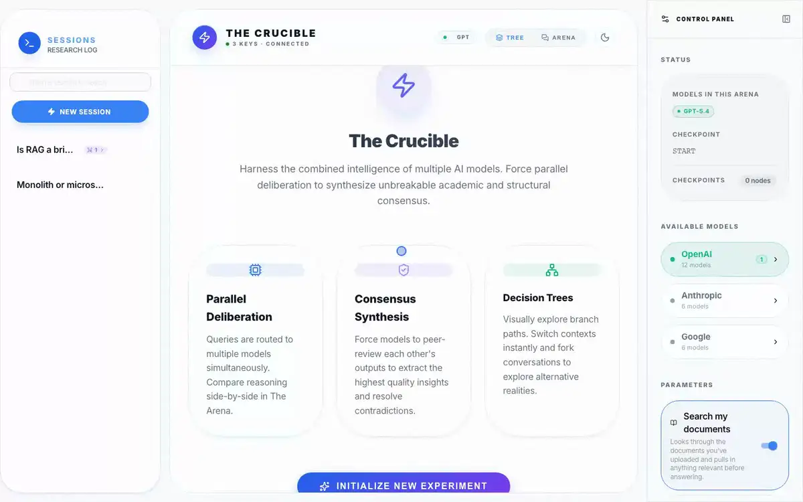

# The Crucible ⚔️

**A multi-model AI arena for branching conversations, structured debate and synthesis.**

The Crucible is a full-stack research interface for putting the same question to OpenAI, Anthropic and Google models at once. Every conversation is a **tree**: you can branch from any point, compare models side by side, have them debate each other over several rounds, and synthesize the results. It also runs headless, as a CLI and as an MCP server for other agents.



<p align="center"><em>A question forks into two branches answered by different models; one branch read as a transcript; then a three-model debate, as lanes with per-round convergence and as a transcript. Tree and transcript are two views of the same session — the view never switches on its own.</em></p>

> Recorded against a session from `scripts/seed_demo.py`; the answers are real output from GPT-5.4, Claude Sonnet 5 and Gemini 3.1 Pro.

---

## ✨ Features

| Feature | What it does |
|---|---|
| **🌳 Conversation trees** | Every message is a checkpoint. Branch from any node, edit a question and re-ask it, and navigate the whole tree on a React Flow canvas. |
| **⚔️ Arena** | Send one prompt to several models. Each answers in parallel on its own branch of the tree, for side-by-side comparison. |
| **🗣️ Debate** | Two or more models argue over several rounds, each seeing the others' previous answers. Stop early on convergence (embedding similarity and/or an LLM judge), pause between rounds, add a note mid-debate, change the topic, and synthesize at the end. |
| **⚖️ Deliberation** | Ask a model to critically review the thread so far, with every earlier message attributed to the model that wrote it. |
| **🤝 Synthesis** | Combine divergent answers into one, stating where the models agree and where they don't. |
| **📎 Documents & RAG** | Attach PDF, TXT, Markdown or CSV files (up to 10 MB). With *Search my documents* on, relevant passages are retrieved and graded before the model answers, with citations. |
| **🌐 Web search** | Let models that support it use their provider's native web-search tool. |
| **🧠 Context management** | When a thread outgrows a model's budget, older history is summarized (keeping who said what) instead of being cut off. |
| **📐 LaTeX** | `$inline$` and `$$block$$` math rendered with KaTeX. |
| **⌨️ CLI & 🤖 MCP** | Run arenas, debates and syntheses from the terminal or from another agent, against the same database as the web UI. |

---

## 🚀 Quick Start

### Prerequisites

- **Node.js** 24+
- **Python** 3.13+ and [**uv**](https://docs.astral.sh/uv/)
- An API key for at least one of OpenAI, Anthropic or Google

### Run locally

```bash
git clone https://github.com/imaknas/the-crucible.git
cd the-crucible

(cd backend && uv sync)          # backend dependencies
(cd frontend && npm install)     # frontend dependencies

./start_dev.sh                   # backend on :8000, frontend on :3000
```

Open **http://localhost:3000**. `start_dev.sh` picks free ports if 8000 or 3000 are taken; `Ctrl+C` stops both servers.

**API keys:** enter them in the app under **Control Panel → API Keys**, or copy `.env.example` to `backend/.env` and fill them in before starting.

<details>
<summary>Start the two servers separately</summary>

```bash
cd backend && uv run python -m app.main     # terminal 1
cd frontend && npm run dev                  # terminal 2
```

</details>

### Run with Docker

```bash
cp .env.example backend/.env     # add your keys (or set them in the app later)
docker compose up --build
```

Frontend on http://localhost:3000, API on http://localhost:8000. Both are published on `127.0.0.1` only. Threads, uploads and the vector store persist in Docker volumes.

| Use | When |
|---|---|
| `./start_dev.sh` | Development: hot reload, fast restarts, easy debugging |
| `docker compose` | Trying it out or running it long-term: no local toolchain needed |

---

## 🔑 Configuration

| Variable | Required | Description |
|---|---|---|
| `OPENAI_API_KEY` | At least one* | OpenAI API key |
| `ANTHROPIC_API_KEY` | At least one* | Anthropic API key |
| `GOOGLE_API_KEY` | At least one* | Google AI API key |
| `NEXT_PUBLIC_API_URL` | No | Backend URL for the frontend (default `http://localhost:8000`) |
| `HOST` | No | Backend bind address (default `127.0.0.1`) |
| `CORS_ORIGINS` | No | Extra browser origins, comma-separated. `localhost` / `127.0.0.1` on any port are always allowed |
| `DATABASE_PATH` | No | SQLite file for threads and checkpoints (default `backend/checkpoints.sqlite`) |
| `CHROMA_DIR` | No | Vector store directory (default `backend/chroma_db`) |
| `CRUCIBLE_ALLOW_REMOTE_CONFIG` | No | Let non-loopback clients use the API-key endpoint. Docker Compose sets it, since it publishes on `127.0.0.1` only |

\* Keys can also be set at runtime in **Control Panel → API Keys**, which writes them to `backend/.env`. That endpoint only accepts requests from the local machine.

> **⚠️ The API has no authentication.** It listens on loopback by default. If you set `HOST=0.0.0.0` to reach it from another machine, anyone on that network can use your API keys.

---

## ⌨️ CLI

The backend installs a `crucible` command. Run it from `backend/` with `uv run`, and repeat `-m` once per model.

```bash
uv run crucible models                                    # model IDs and which have keys
uv run crucible arena "Is P = NP?" -m gpt-5.4 -m claude-sonnet-5
uv run crucible deliberate "Topic" -m gpt-5.4 -m claude-sonnet-5 --rounds 3 --threshold 0.92
uv run crucible synthesize --thread <thread_id>           # or --debate <session_id>
uv run crucible chat "Follow-up" -m gpt-5.4 --thread <thread_id>
uv run crucible tree --thread <thread_id> [--open]        # --open shows it in the web UI
uv run crucible threads
```

`arena`, `deliberate`, `synthesize`, `chat`, `threads` and `models` accept `--format json`: stdout then carries only the JSON document, and failures exit non-zero with the message on stderr. Everything the CLI creates appears in the web UI.

---

## 🤖 MCP Server

The Crucible can act as a tool for other agents over the [Model Context Protocol](https://modelcontextprotocol.io). Add it to your client's MCP settings (for Claude Desktop, `~/Library/Application Support/Claude/claude_desktop_config.json`):

```json
{
  "mcpServers": {
    "the-crucible": {
      "command": "uv",
      "args": ["--directory", "/absolute/path/to/the-crucible/backend", "run", "python", "app/mcp_server.py"],
      "env": {
        "OPENAI_API_KEY": "your-key",
        "ANTHROPIC_API_KEY": "your-key",
        "GOOGLE_API_KEY": "your-key"
      }
    }
  }
}
```

All tools return structured JSON and raise an MCP error on failure:

| Tool | Purpose |
|---|---|
| `list_models` | Model IDs and whether each has an API key configured |
| `invoke_arena` | Ask several models the same question in parallel; returns each answer (with its checkpoint id) and an optional synthesis |
| `run_debate` | Multi-round debate between two or more models, with optional convergence stopping and a final synthesis |
| `list_threads`, `get_thread_status`, `get_thread_summary` | Find threads and read their latest model, thesis and context summary |
| `get_thread_messages` | Read one path of a thread; pass a `checkpoint_id` from `invoke_arena` to read one model's branch |
| `get_branch_answers` | The latest answer on every branch of a thread |

The conversation tree with per-node metadata is also available over REST: `GET /graph/{thread_id}/topology`.

---

## 🏗️ Architecture

```
the-crucible/
├── backend/                 FastAPI + LangGraph + SQLite
│   └── app/
│       ├── main.py          App assembly only (lifespan, CORS, routers)
│       ├── api/             HTTP & WebSocket routes — transport only
│       ├── services/        Behaviour: chat turns, debates, convergence, tree, RAG
│       ├── llm/             Model providers and the ModelFactory
│       ├── core/            SQLite persistence and the graph state schema
│       ├── cli.py           `crucible` command
│       └── mcp_server.py    MCP tools
├── frontend/                Next.js + MUI + React Flow
│   └── src/
│       ├── app/page.tsx     App shell: composes hooks and components
│       ├── hooks/           State and sockets (chat, debate session, tree, threads…)
│       ├── components/      UI (TreeCanvas, ChatView, ControlPanel sections…)
│       └── lib/             API client, pure reducers, shared types
├── e2e/                     Playwright suite and its fixture builder
└── scripts/                 Demo data and the README recording
```

- **One LangGraph workflow** handles every turn: summarize if needed → optional retrieval and grading → draft → update the thread's running thesis. State lives in SQLite checkpoints, which is what makes branching from any node possible.
- **Parallel models fork from one checkpoint.** Every model in a turn is pinned to the same parent, so answers land on sibling branches instead of reading each other's half-finished turn.
- **Models come from a factory.** Each provider is a small strategy class in `backend/app/llm/providers.py`; nothing else in the code branches on the provider, and tests inject scripted models instead of patching globals.
- **Debates run per model.** Each participant gets its own sub-thread, all stream concurrently each round, and convergence checks are interchangeable strategies.

[`CLAUDE.md`](CLAUDE.md) is the detailed maintainer guide: design invariants, where each kind of change belongs, and how to test it.

### Tech stack

| Layer | Stack |
|---|---|
| **Frontend** | Next.js 16, React 19, MUI 7, React Flow, Framer Motion, react-markdown, KaTeX |
| **Backend** | FastAPI, LangGraph, LangChain, SQLite, ChromaDB, tiktoken |
| **Embeddings** | Local HuggingFace `all-MiniLM-L6-v2` |
| **Providers** | OpenAI, Anthropic, Google (via `langchain-*`) |

---

## 🧪 Testing

```bash
(cd backend && uv run pytest tests/ -q)     # backend unit + integration
(cd frontend && npm test)                   # frontend unit (Jest)

npm install && npx playwright install chromium   # once, at the repo root
npm run test:e2e                                 # end-to-end (Playwright)
```

The end-to-end suite builds its own fixture database (`e2e/seed_db.py`) and starts both servers against it with **scripted models** (`CRUCIBLE_FAKE_LLM=1`): replies stream like a real provider's, so it can send messages and run whole debates without network access or cost, and it never touches your real data. If ports 8123/3123 are taken, set `E2E_BACKEND_PORT` / `E2E_FRONTEND_PORT`.

<details>
<summary>Re-recording the demo</summary>

```bash
uv run --project backend python scripts/seed_demo.py     # makes real model calls
cd backend && DATABASE_PATH=../scripts/.demo/demo.sqlite \
  uv run python -m uvicorn app.main:server --port 8200 &
cd frontend && NEXT_PUBLIC_API_URL=http://127.0.0.1:8200 npx next build \
  && npx next start -p 3200 &
node scripts/record_demo.mjs      # docs/demo.webp (light mode; needs ffmpeg and uv)
```

</details>

---

## 🤝 Contributing

Contributions are welcome — a new model, a better tree layout, a bug fix.

1. Create a branch: `git checkout -b feat/your-feature`
2. Make the change; [`CLAUDE.md`](CLAUDE.md) lists where each kind of change belongs. Run the tests above.
3. Commit using [Conventional Commits](https://www.conventionalcommits.org/) (`feat:`, `fix:`, `docs:`, `refactor:`, `test:`), e.g. `feat: add support for DeepSeek models`
4. Push and open a pull request.

---

## 📝 License

[MIT](LICENSE)
