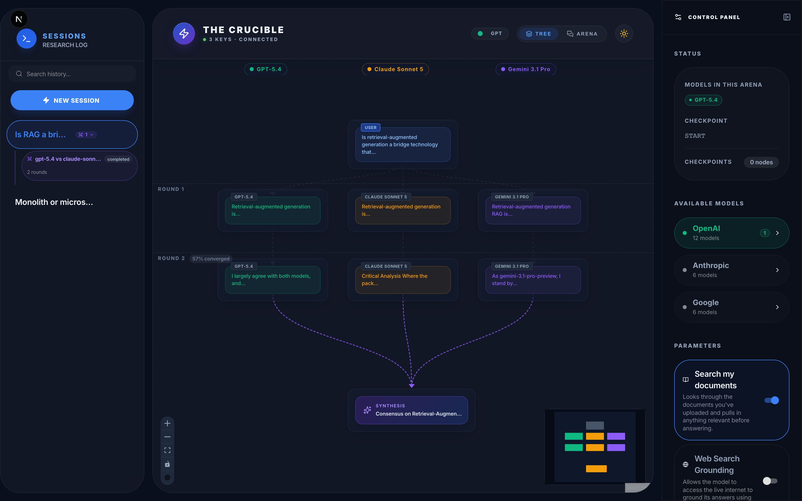
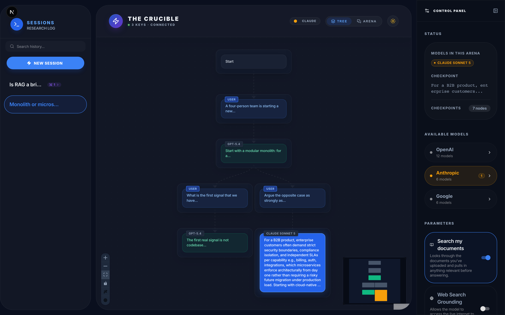
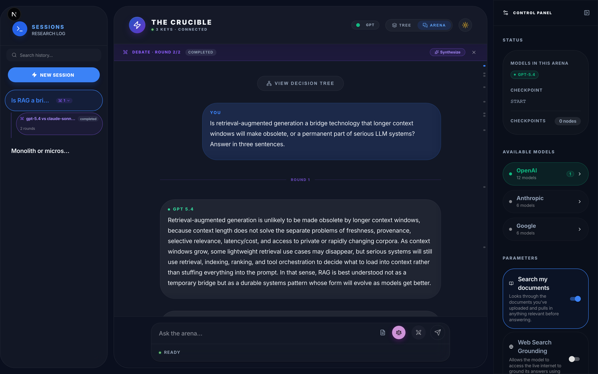

# The Crucible ⚔️

**A multi-model AI arena for non-linear debate, deliberation, and consensus.**

The Crucible is an open-source, full-stack research interface that lets you orchestrate conversations across OpenAI, Anthropic, and Google models — simultaneously. Unlike traditional linear chat apps, every conversation is a **tree**: you can branch, rewind, pit models against each other, and synthesize their best ideas into a unified thesis.



<p align="center"><em>Debate Mode — three models argue across two rounds in parallel lanes, with per-round convergence scoring, then converge into a single synthesis.</em></p>

---

## 📸 A Look Inside

<table>
<tr>
<td width="50%" valign="top">

**Every conversation is a tree**

Ask once, then fork. Here one answer branches into two lines of enquiry — a follow-up to GPT-5.4, and the opposite case argued by Claude Sonnet 5 — from the same checkpoint. Click any node to expand it in place; drag to rearrange; the layout keeps parents centred over their children.

</td>
<td width="50%">



</td>
</tr>
<tr>
<td width="50%" valign="top">

**Read the debate as a transcript**

The same session in Arena view: round separators, per-model attribution, and the running debate status with a one-click Synthesize. Switch between tree and transcript at any time — the view never moves on its own.

</td>
<td width="50%">



</td>
</tr>
</table>

> Screenshots show a demo session generated by `scripts/seed_demo.py`. The model responses are real output from GPT-5.4, Claude Sonnet 5, and Gemini 3.1 Pro.

---

## ✨ Features

| Feature | Description |
|---|---|
| **🌳 Conversation Trees** | Every message is a node. Branch off any point, explore alternate timelines, and navigate visually via a React Flow canvas. |
| **⚔️ Arena Mode** | Select multiple models and fire a single prompt. Each model responds in parallel, creating side-by-side branches for instant comparison. |
| **⚖️ Deliberation** | Invite a different model to critically review an existing conversation thread — with full speaker attribution so it knows who said what. |
| **🤝 Consensus Engine** | Select divergent responses and synthesize them into a single, cohesive academic brief. |
| **🧠 Smart Compression** | Automatic context management via `tiktoken`. When token counts approach a model's limit, older history is compressed into a technical brief — with speaker attribution preserved. |
| **📐 LaTeX Math** | Native rendering of `$inline$` and `$$block$$` math expressions via KaTeX. |
| **🕐 Temporal Context** | Models automatically receive the current date, time, and timezone — just like official web clients. |
| **📎 Document Attachments** | Upload PDFs mid-conversation. Documents are parsed and indexed for retrieval. |
| **🔍 RAG (Knowledge Search)** | Enable the RAG toggle to perform semantic search across your uploaded documents. |
| **🌐 Web Search Grounding** | Let models access the live internet via their native search tool (Google Search, Bing, Anthropic web search). |
| **🤖 Agentic Bridge (MCP)** | Built-in Model Context Protocol server. Agents (Claude, Cursor) can run a multi-model arena and query a thread's thesis and summary. |

---

## 🤖 Agentic Integration (MCP)

The Crucible includes a built-in **Model Context Protocol (MCP)** server, enabling AI agents to use The Crucible as a programmable decision-making tool.

### Setup for Claude Desktop / Cursor

Add the following to your MCP settings file (e.g., `~/Library/Application Support/Claude/claude_desktop_config.json`):

```json
{
  "mcpServers": {
    "the-crucible": {
      "command": "uv",
      "args": [
        "--directory",
        "/absolute/path/to/the-crucible/backend",
        "run",
        "python",
        "app/mcp_server.py"
      ],
      "env": {
        "OPENAI_API_KEY": "your-key",
        "ANTHROPIC_API_KEY": "your-key",
        "GOOGLE_API_KEY": "your-key"
      }
    }
  }
}
```

### Available Tools

All tools return structured JSON and raise an MCP error on failure.

- `list_models`: Model IDs and whether each has an API key configured.
- `invoke_arena`: Ask several models the same question in parallel; returns every model's answer (with its checkpoint id) plus an optional synthesis written by one more model.
- `run_debate`: Multi-round structured debate between two or more models, with optional convergence stopping and a final synthesis. The session also shows up in the web UI.
- `list_threads` / `get_thread_status` / `get_thread_summary`: Find threads and read their latest model, thesis and context summary.
- `get_thread_messages`: Read one path of a thread — pass a `checkpoint_id` from `invoke_arena` to read a specific model's branch.
- `get_branch_answers`: The latest answer on every branch of a thread.

The conversation tree with per-node metadata (confidence, conflicts) is available over REST rather than MCP: `GET /graph/{thread_id}/topology`.

---

## ⌨️ CLI

The backend installs a `crucible` command (run it from `backend/` with `uv run`). Repeat `-m` once per model.

```bash
uv run crucible models                                   # model IDs and which have keys
uv run crucible arena "Is P = NP?" -m gpt-5.4 -m claude-sonnet-5
uv run crucible deliberate "Topic" -m gpt-5.4 -m claude-sonnet-5 --rounds 3 --threshold 0.92
uv run crucible synthesize --thread <thread_id>          # or --debate <session_id>
uv run crucible chat "Follow-up" -m gpt-5.4 --thread <thread_id>
uv run crucible tree --thread <thread_id> [--open]       # --open shows it in the web UI
uv run crucible threads
```

`arena`, `deliberate`, `synthesize`, `chat`, `threads` and `models` accept `--format json`: stdout then carries only the JSON document, and failures exit non-zero with the message on stderr. `deliberate` uses the same debate engine as the web UI, so CLI debates appear there too.

---

## 🏗️ Architecture

```
the-crucible/
├── backend/           # FastAPI + LangGraph + SQLite
│   ├── app/           # Modular application package
│   │   ├── api/       # FastAPI route modules (threads, history, models, etc.)
│   │   ├── core/      # Database logic, schema, and core config
│   │   ├── services/  # LangGraph, RAG, and tree reconstruction logic
│   │   ├── utils/     # Parsers and helper functions
│   │   └── main.py    # WebSocket server & entry point
│   ├── tests/         # Pytest suite
│   ├── chroma_db/     # Persistent vector storage (git-ignored)
│   └── Dockerfile     # Optimized for Python 3.13 + uv
└── frontend/          # Next.js + MUI + React Flow
    └── src/
        ├── app/
        │   ├── layout.tsx
        │   └── page.tsx    # Main orchestrator (WS, state, routing)
        ├── components/
        │   ├── ChatView.tsx      # Markdown + LaTeX message renderer
        │   ├── TreeCanvas.tsx    # React Flow conversation tree
        │   ├── ControlPanel.tsx  # Model selector + toggles
        │   ├── Sidebar.tsx       # Thread list
        │   ├── LandingView.tsx   # Welcome screen
        │   └── ...
        ├── lib/api.ts    # Centralized API client
        └── theme.ts      # MUI theme configuration
```

### Tech Stack

| Layer | Stack |
|---|---|
| **Frontend** | Next.js 16, React, MUI, React Flow, Framer Motion, react-markdown, KaTeX |
| **Backend** | FastAPI, LangGraph, LangChain, ChromaDB, SQLite, WebSockets, tiktoken |
| **Embeddings** | HuggingFace (local `all-MiniLM-L6-v2`) |
| **AI Providers** | OpenAI, Anthropic, Google (via `langchain-*` SDKs) |

---

## 🚀 Quick Start

### Prerequisites

- **Node.js** 24+
- **Python** 3.13+
- **uv** (recommended) or pip
- At least one API key: `OPENAI_API_KEY`, `ANTHROPIC_API_KEY`, or `GOOGLE_API_KEY`

### Setup

```bash
# 1. Clone the repo
git clone https://github.com/YOUR_USERNAME/the-crucible.git
cd the-crucible

# 2. Backend
cd backend
uv venv && source .venv/bin/activate
uv sync
cd ..

# 4. Frontend
cd frontend
npm install
cd ..

# 5. Launch everything
chmod +x start_dev.sh
./start_dev.sh
```

Open **http://localhost:3000** and step into The Crucible.

> **Tip:** `start_dev.sh` starts both the FastAPI backend (port 8000) and Next.js frontend (port 3000) in a single terminal. Press `Ctrl+C` to shut down both.

> **API Keys:** You can configure your OpenAI, Anthropic, and Google API keys directly in the app via **Control Panel → API Keys** — no `.env` file required. Alternatively, copy `.env.example` to `backend/.env` and set the keys there before starting.

### Manual Start (if you prefer)

```bash
# Terminal 1 — Backend
cd backend && uv run python -m app.main

# Terminal 2 — Frontend
cd frontend && npm run dev
```

### 🐳 Run with Docker (Recommended)

The easiest way to run the entire stack is using Docker Compose.

1. **Configure environment**: 
   Copy `.env.example` to `backend/.env` and set your API keys (or configure them in the app after launch).
2. **Launch**:
   ```bash
   docker compose up --build
   ```
3. **Access**:
   - Frontend: [http://localhost:3000](http://localhost:3000)
   - Backend API: [http://localhost:8000](http://localhost:8000)

> **Note:** The SQLite database is persisted in a Docker volume named `crucible_data`.

---

## 🛠️ Choosing Your Environment

| Method | Recommended For | Perks |
|---|---|---|
| **`./start_dev.sh`** | **Active Development** | Hot reloading, fast startup, easy debugging. |
| **`docker compose`** | **Evaluation & Deployment** | Zero-config env, high stability, exact production parity. |

---

## 🔑 Environment Variables

| Variable | Required | Description |
|---|---|---|
| `OPENAI_API_KEY` | At least one* | OpenAI API key |
| `ANTHROPIC_API_KEY` | At least one* | Anthropic API key |
| `GOOGLE_API_KEY` | At least one* | Google AI API key |
| `NEXT_PUBLIC_API_URL` | No | Backend URL (defaults to `http://localhost:8000`) |
| `HOST` | No | Backend bind address (defaults to `127.0.0.1`) |
| `CORS_ORIGINS` | No | Extra allowed browser origins, comma-separated. `localhost` / `127.0.0.1` on any port are always allowed |
| `CRUCIBLE_ALLOW_REMOTE_CONFIG` | No | Let non-loopback clients use `/config/keys`. Docker Compose sets it, since it publishes ports on `127.0.0.1` only |

> \* Keys can also be set at runtime via **Control Panel → API Keys** in the UI, which writes them to `backend/.env` automatically. That endpoint only accepts requests from the local machine.

> **The API has no authentication.** It binds to loopback by default; if you set `HOST=0.0.0.0` to reach it from another machine, anyone on that network can use your API keys.

---

## 🧪 Running Tests

```bash
# Backend — pytest
cd backend && uv run pytest tests/ -v

# Frontend — jest
cd frontend && npm test

# End-to-end — Playwright (seeds an isolated fixture DB, then drives both servers)
npm run test:e2e
```

The E2E suite runs against `e2e/.fixtures/e2e.sqlite`, built by `e2e/seed_db.py`
with the LLM stubbed — it never touches your real database and never calls a
model. See `CLAUDE.md` for details.

### Regenerating the screenshots

```bash
uv run --project backend python scripts/seed_demo.py     # makes real model calls
cd backend && DATABASE_PATH=../scripts/.demo/demo.sqlite \
  uv run python -m uvicorn app.main:server --port 8200 &
cd frontend && NEXT_PUBLIC_API_URL=http://127.0.0.1:8200 npx next dev --port 3200 &
node scripts/capture_screenshots.mjs
```

---

## 🤝 Contributing

Contributions are welcome! Whether it's adding a new model, improving the tree layout, or fixing a bug, your help is appreciated.

This project follows the [Conventional Commits](https://www.conventionalcommits.org/) specification for commit messages.

1. Clone the repository and create a branch:
   ```bash
   git checkout -b feat/amazing-feature
   ```
2. Commit your changes following the format:
   - `feat:` for new features
   - `fix:` for bug fixes
   - `docs:` for documentation updates
   - `refactor:` for code restructurings
   - `test:` for adding/updating tests
   - *Example: `git commit -m "feat: add support for DeepSeek models"`*
3. Push to your branch and open a Pull Request.

---

## 📝 License

This project is licensed under the [MIT License](LICENSE).
